# RoomieMatch : Flatmate Matching Platform

A fullstack flatmate matching platform connecting room seekers with owners, featuring a lifestyle-based compatibility algorithm.

> **Stack** : Django · HTMX · Tailwind CSS · Alpine.js · Redis · Celery

---

## 📸 Screenshots

### Home page
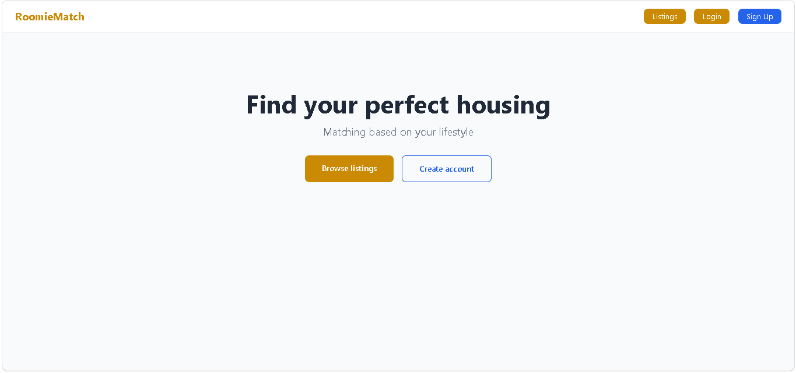

### Listings page
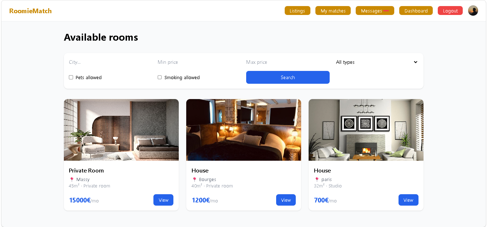

### Listing detail
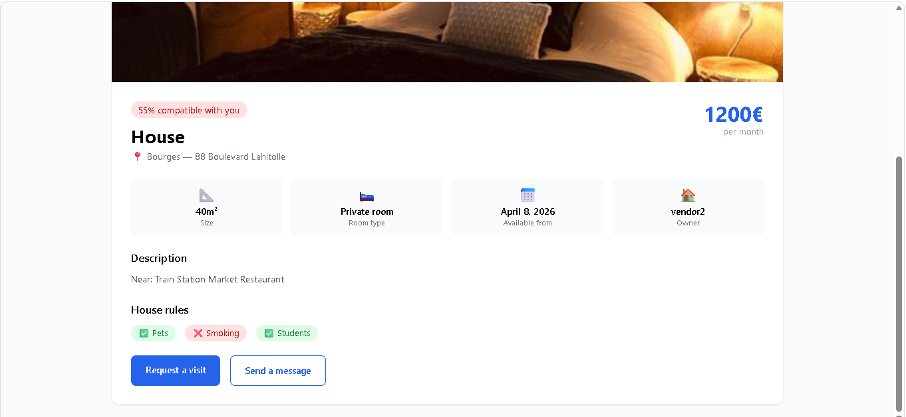

### My matches
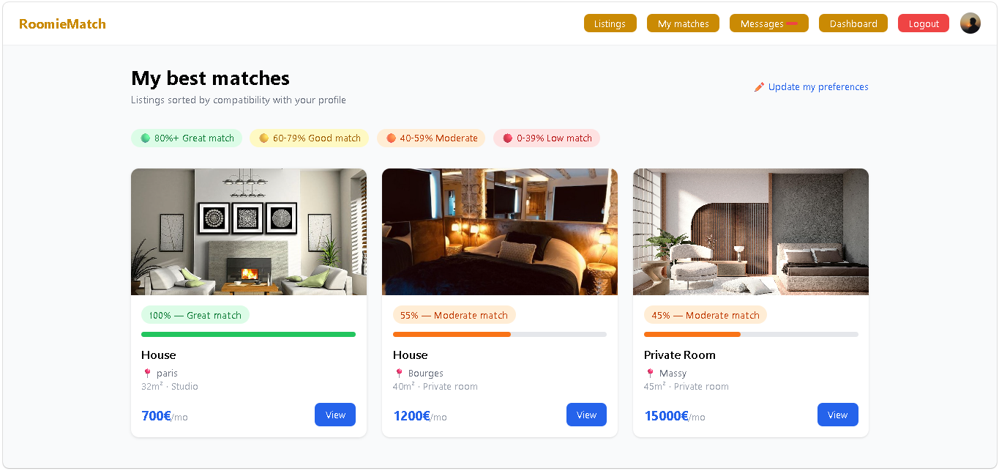

### Messaging
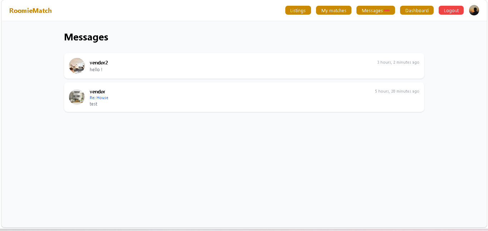

### Visit requests


### Dashboard
Seeker
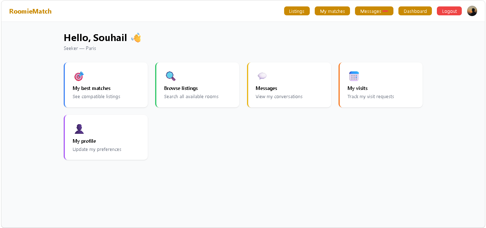
Owner
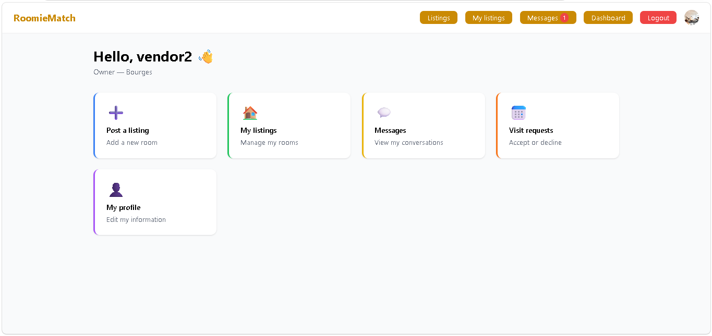

---

## 👥 User roles

| Role | What they can do |
|---|---|
| 🔍 **Seeker** | Browse listings, see compatibility scores, request visits, message owners |
| 🏠 **Owner** | Post listings, manage visit requests, set availability, message seekers |

---

## 🗂️ Main features

### 1. 🔐 Authentication
- Registration with role selection (Seeker or Owner)
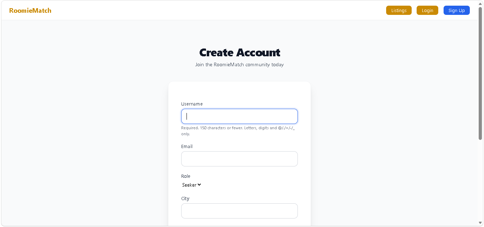
- Auto redirect to dashboard after login
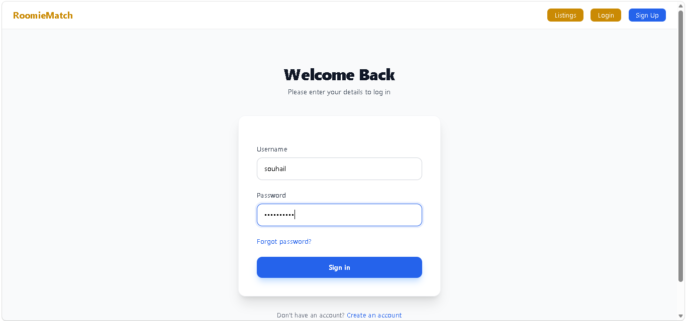
- Profile with avatar upload and lifestyle preferences
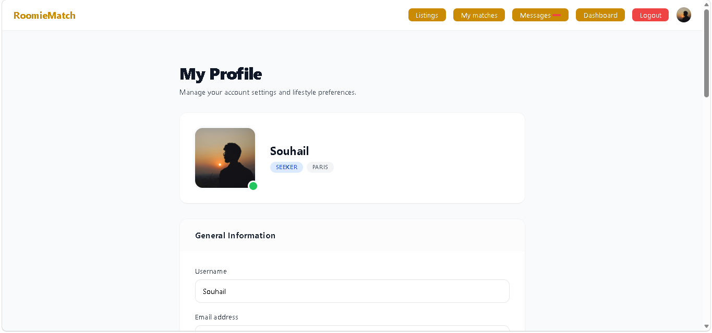

### 2. 🏠 Listings
- Owners post rooms with photos (up to 10), price, size and house rules
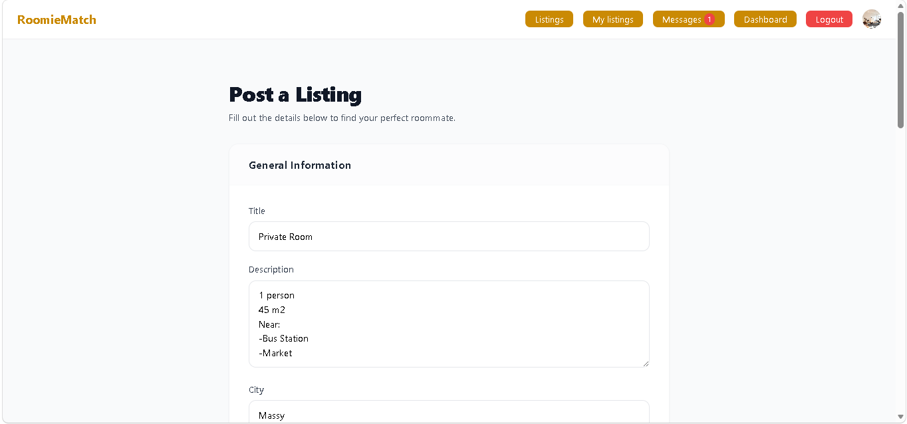
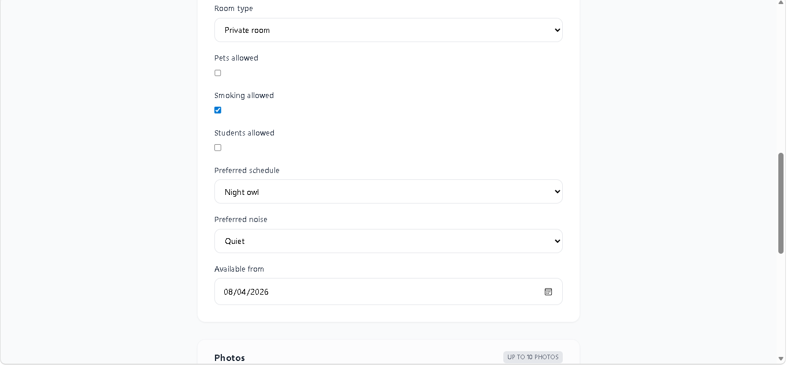
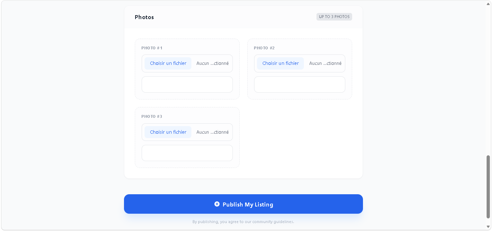
- Public listing page with live filters (city, price, room type, pets, smoking)

- HTMX live filtering — no page reload when applying filters
- Pagination (9 listings per page)
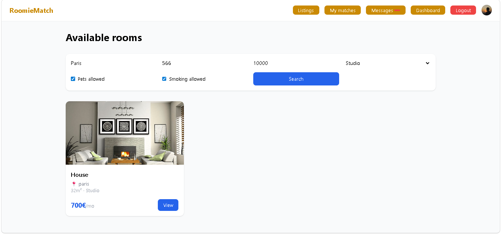

### 3. 🎯 Compatibility Matching
- Algorithm calculates a score between seeker profile and each listing
- Score based on budget, schedule, noise level, pets, smoking, student status
- "My matches" page shows listings sorted by compatibility score
- Score badge on every listing card (green / yellow / orange / red)


### 4. 💬 Messaging
- Internal messaging between seekers and owners
- HTMX — send messages without page reload
- Auto polling every 5 seconds for new messages
- Unread message counter in navbar

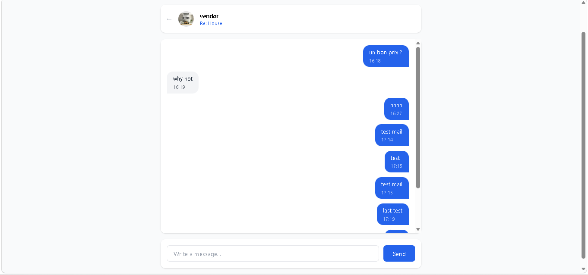

### 5. 📅 Visit requests
- Seeker requests a visit with date, time and message
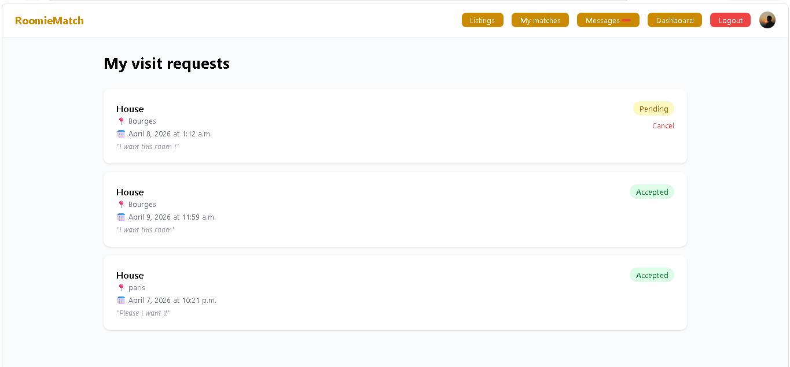
- Owner accepts or declines with one click (HTMX — no page reload)
- Owner sets available dates for each listing
- Seeker can cancel pending requests
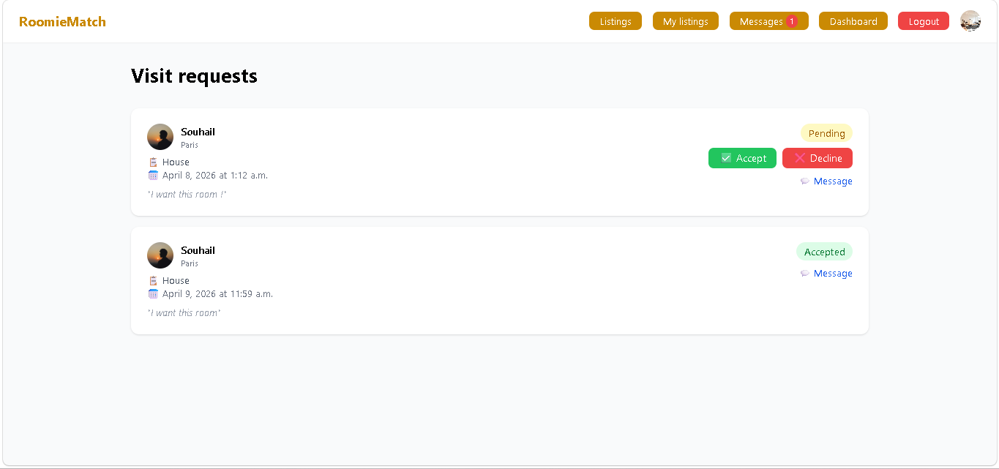

### 6. 📧 Email notifications
- All emails sent asynchronously via Celery — no blocking
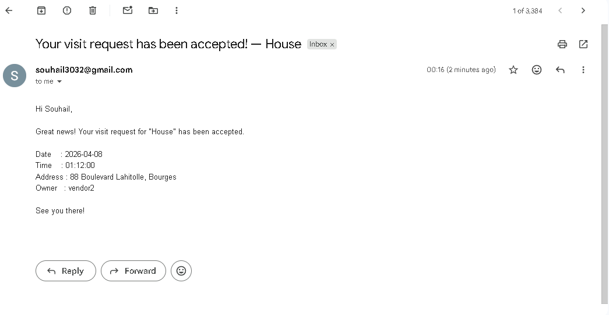

---

## 📡 URL routes

### Accounts — `/accounts/`

| Method | URL | Description | Access |
|---|---|---|---|
| `GET/POST` | `/accounts/register/` | Sign up | Public |
| `GET/POST` | `/accounts/login/` | Login | Public |
| `GET` | `/accounts/logout/` | Logout | Logged in |
| `GET/POST` | `/accounts/profile/` | View / edit profile | Logged in |
| `GET` | `/accounts/dashboard/` | Dashboard by role | Logged in |

### Listings — `/listings/`

| Method | URL | Description | Access |
|---|---|---|---|
| `GET` | `/listings/` | Browse listings with filters | Public |
| `GET` | `/listings/<id>/` | Listing detail | Public |
| `GET/POST` | `/listings/create/` | Post a listing | Owner |
| `GET/POST` | `/listings/<id>/edit/` | Edit a listing | Owner |
| `POST` | `/listings/<id>/delete/` | Delete a listing | Owner |
| `GET` | `/listings/my-listings/` | My listings | Owner |

### Matching — `/`

| Method | URL | Description | Access |
|---|---|---|---|
| `GET` | `/matches/` | Best matches sorted by score | Seeker |

### Messaging — `/messages/`

| Method | URL | Description | Access |
|---|---|---|---|
| `GET` | `/messages/` | Inbox | Logged in |
| `GET/POST` | `/messages/<id>/` | Conversation detail | Logged in |
| `GET` | `/messages/start/<user_id>/` | Start a conversation | Logged in |
| `GET` | `/messages/unread/` | Unread count (HTMX) | Logged in |

### Visits — `/visits/`

| Method | URL | Description | Access |
|---|---|---|---|
| `GET` | `/visits/my-visits/` | My visit requests | Seeker |
| `GET` | `/visits/manage/` | Manage visit requests | Owner |
| `GET/POST` | `/visits/request/<listing_id>/` | Request a visit | Seeker |
| `POST` | `/visits/<id>/<action>/` | Accept or decline | Owner |
| `POST` | `/visits/cancel/<id>/` | Cancel a request | Seeker |
| `GET/POST` | `/visits/availability/<listing_id>/` | Set availability | Owner |

---

## 📧 Email notifications

| Event | Recipient | Trigger |
|---|---|---|
| Visit requested | Owner | Seeker sends visit request |
| Visit accepted | Seeker | Owner accepts |
| Visit declined | Seeker | Owner declines |
| New message | Recipient | New message sent |
| Listing created | Owner | New listing posted |

> All emails are sent asynchronously via **Celery + Redis** — the user gets an instant response without waiting for the email.

---

## 🎯 Matching algorithm

```
Budget match        → 25 points
Schedule match      → 20 points
Noise level match   → 20 points
Pets match          → 15 points
Smoking match       → 10 points
Student match       → 10 points
──────────────────────────────
Total               → 100 points
```

Scores are cached in the database to avoid recalculating on every request.

---

## 🧪 Test accounts

```
Seeker: user: Souhail mdp: Seeker1234
Owner : user: vendor  mdp: Vendor1234
Owner : user: vendor2 mdp: Vendor1234

```

---

## ⚙️ Installation

Create .env inside backend:

```bash
SECRET_KEY=
DEBUG=True
DATABASE_URL=sqlite:///db.sqlite3
ALLOWED_HOSTS=127.0.0.1,localhost
# Redis
REDIS_URL=
# Email (Gmail)
EMAIL_BACKEND=django.core.mail.backends.smtp.EmailBackend
EMAIL_HOST=smtp.gmail.com
EMAIL_PORT=587
EMAIL_USE_TLS=True
EMAIL_HOST_USER=
EMAIL_HOST_PASSWORD=
DEFAULT_FROM_EMAIL=
```
After:

```bash
# Backend
cd backend
python -m venv envroom
.\envroom\Scripts\Activate
pip install -r requirements.txt
python manage.py migrate
python manage.py createsuperuser
python manage.py runserver

# Celery (async emails)
celery -A config worker --loglevel=info --pool=solo
```

---

### Recommended deployment

| Service | Usage |
|---|---|
| **Railway** | Django backend + PostgreSQL |
| **Upstash** | Redis |
| **Cloudinary** | Media files (photos) |


## 👤 Author

**Souhail HMAHMA** — Full Stack Developer

🌐 [souhail3.vercel.app](https://souhail3.vercel.app) · 💼 [LinkedIn](https://linkedin.com/in/souhail-hmahma) · 🐙 [GitHub](https://github.com/souhmahma)
